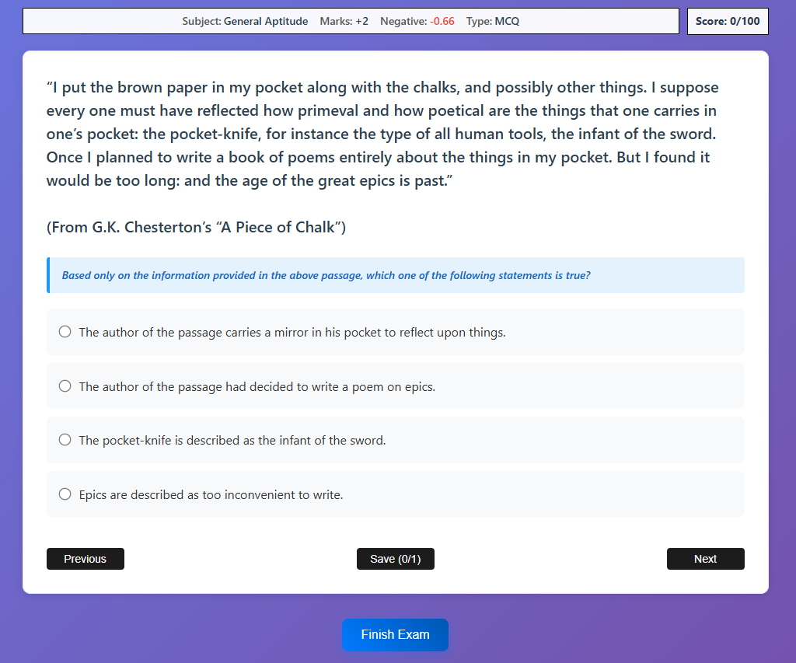

# GatePixels

A React-based GATE (Graduate Aptitude Test in Engineering) exam practice application that provides an interactive platform for students to practice GATE questions with a realistic exam interface.

## Features

- **Multiple Question Types**: Support for MCQ (Multiple Choice Questions), MSQ (Multiple Select Questions), and NAT (Numerical Answer Type) questions
- **Timer Functionality**: Built-in timer to simulate real exam conditions
- **Progress Tracking**: Visual progress indicator and score counter
- **Multiple Papers**: 5 different practice papers with comprehensive question sets
- **Subject Coverage**: Questions from various GATE subjects including:
  - General Aptitude
  - Computer Organization and Architecture (COA)
  - Compiler Design
  - Operating Systems (OS)
  - Database Management Systems (DBMS)
  - Computer Networks (CN)
  - Discrete Mathematics
  - Algorithms
  - Theory of Computation (TOC)
  - Engineering Mathematics
  - Digital Logic Design (DLD)
  - Programming and Data Structures

## Tech Stack

- **Frontend**: React 19.1.1
- **Routing**: React Router DOM 7.9.1
- **Build Tool**: Vite 7.1.2
- **Styling**: CSS Modules

## Screenshots

